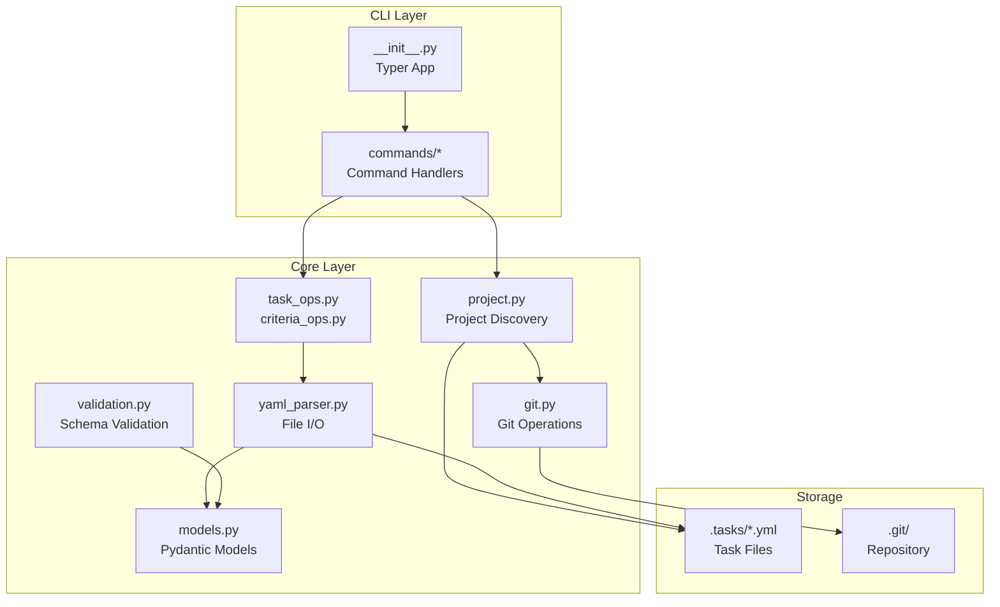
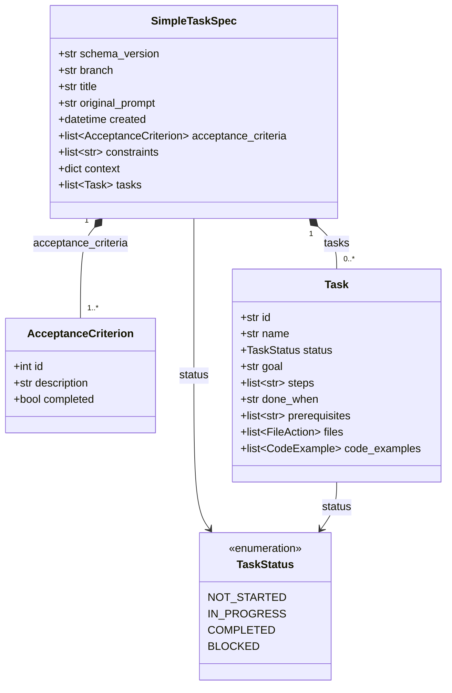
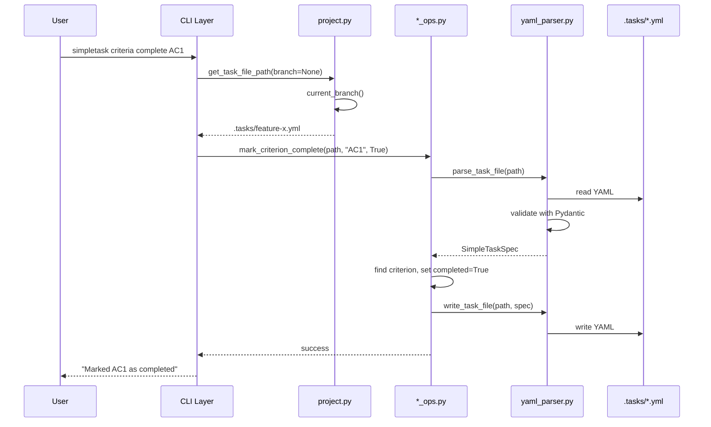

# Architecture

High-level system architecture for AI agents working with the codebase.

## Overview

Simpletask is an AI-friendly task definition manager that couples git branches with structured task specifications. Each feature branch has a corresponding YAML task file that serves as the single source of truth for requirements, acceptance criteria, and implementation progress.

**Core Design Principles:**

- **Branch-Task Coupling**: One task file per branch, branch name = task identifier
- **YAML as Single Source of Truth**: All task state lives in `.tasks/<branch>.yml`
- **Strict Validation**: Pydantic models with `extra="forbid"` reject unknown fields
- **Separation of Concerns**: CLI layer separated from core business logic
- **Convention over Configuration**: Fixed directory structure, no config files needed

## System Layers

- **CLI Layer**: Handles argument parsing, user interaction, and exit codes via Typer
- **Core Layer**: Pure business logic with no CLI dependencies - models, file I/O, git operations
- **Storage**: Task YAML files in `.tasks/` directory, one per branch

## Domain Model

## Data Flow

Command execution follows this pattern (example: marking a criterion complete):

## Key Design Decisions

### Branch-Task Coupling

Every task is identified by its git branch name. The task file path is derived from the branch: `.tasks/<branch>.yml`. Checking out a branch switches to that task's context.

### Single Source of Truth

The YAML task file contains everything about a task: original prompt, acceptance criteria, implementation tasks, constraints, and progress. No external database or state management needed.

### Strict Pydantic Validation

All models use `extra="forbid"` to reject unknown fields. This catches typos and ensures data integrity. The `acceptance_criteria` list must have at least one item.

### Layer Separation

- **CLI Layer** (`commands/`): Argument parsing, user interaction, exit codes
- **Core Layer** (`core/`): Pure business logic, no Typer or Rich dependencies
- **Utils** (`utils/`): Cross-cutting concerns like console output
