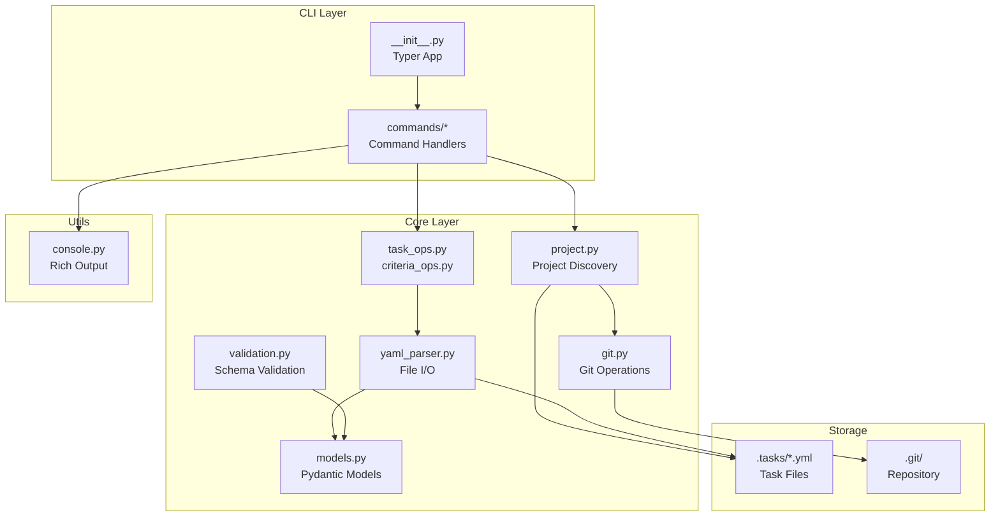
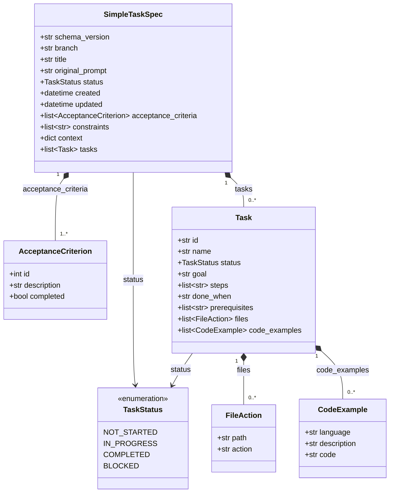
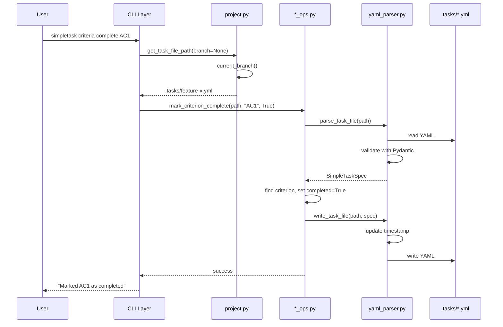
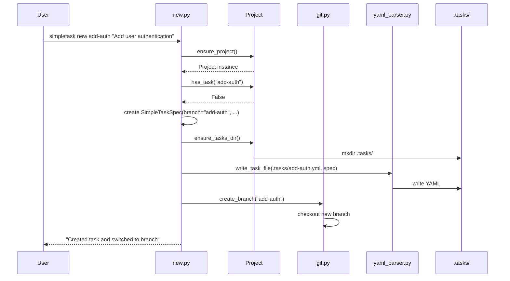

# Simpletask Architecture

This document provides a high-level overview of simpletask's architecture for developers and AI agents working with the codebase.

> **Related documentation**: See [AGENTS.md](../AGENTS.md) for contribution guidelines, code style, and development commands.

## Overview

Simpletask is an AI-friendly task definition manager that couples git branches with structured task specifications. Each feature branch has a corresponding YAML task file that serves as the single source of truth for requirements, acceptance criteria, and implementation progress.

**Core Design Principles:**
- **Branch-Task Coupling**: One task file per branch, branch name = task identifier
- **YAML as Single Source of Truth**: All task state lives in `.tasks/<branch>.yml`
- **Strict Validation**: Pydantic models with `extra="forbid"` reject unknown fields
- **Separation of Concerns**: CLI layer separated from core business logic
- **Convention over Configuration**: Fixed directory structure, no config files needed

## System Architecture



## Component Overview

| Module | Purpose | Key Exports |
|--------|---------|-------------|
| `core/models.py` | Pydantic data models for task files | `SimpleTaskSpec`, `Task`, `AcceptanceCriterion`, `TaskStatus` |
| `core/project.py` | Project root discovery, task file paths | `Project`, `find_project()`, `ensure_project()` |
| `core/yaml_parser.py` | YAML read/write with validation | `parse_task_file()`, `write_task_file()` |
| `core/git.py` | GitPython wrapper for branch ops | `current_branch()`, `create_branch()`, `is_main_branch()` |
| `core/task_ops.py` | CRUD for implementation tasks | `add_implementation_task()`, `update_implementation_task()` |
| `core/criteria_ops.py` | CRUD for acceptance criteria | `add_acceptance_criterion()`, `mark_criterion_complete()` |
| `core/validation.py` | JSON Schema validation | `validate_task_file()`, `get_bundled_schema()` |
| `core/ai_templates.py` | AI editor template management | `install_templates()`, `install_qwen_templates()` |
| `utils/console.py` | Rich console output helpers | `success()`, `error()`, `info()`, `warning()` |

## Domain Model



## Data Flow

### Command Execution Flow



### Task Creation Flow



## Key Design Decisions

### 1. Branch-Task Coupling
Every task is identified by its git branch name. The task file path is derived from the branch: `.tasks/<branch>.yml`. This enables automatic context switching - checking out a branch switches to that task's context.

### 2. Single Source of Truth
The YAML task file contains everything about a task: original prompt, acceptance criteria, implementation tasks, constraints, and progress. No external database or state management needed.

### 3. Strict Pydantic Validation
All models use `extra="forbid"` to reject unknown fields. This catches typos and ensures data integrity. The `acceptance_criteria` list must have at least one item.

### 4. Layer Separation
- **CLI Layer** (`commands/`): Handles argument parsing, user interaction, exit codes
- **Core Layer** (`core/`): Pure business logic, no Typer or Rich dependencies
- **Utils** (`utils/`): Cross-cutting concerns like console output

### 5. Graceful Git Degradation
Git operations return `None` or `False` on failure rather than raising exceptions. The `GIT_AVAILABLE` flag allows operation without GitPython installed.

### 6. Dual Validation Strategy
- **Pydantic**: Runtime validation during object creation (enforced)
- **JSON Schema**: Explicit validation via `simpletask schema validate` command (optional)

## Extension Points

### Adding a New CLI Command

1. Create module in `commands/` (e.g., `commands/report.py`)
2. Define function with Typer annotations
3. Register in `__init__.py`:
   ```python
   app.command(name="report")(report.report_command)
   ```

### Adding a New Subcommand Group

1. Create directory `commands/newgroup/`
2. Create `__init__.py` with `app = typer.Typer()`
3. Create command modules and register them
4. Register group in main `__init__.py`:
   ```python
   app.add_typer(newgroup.app, name="newgroup")
   ```

### Adding AI Editor Support

1. Create template directory: `cli/simpletask/templates/<editor>/`
2. Add template files in editor's format
3. Add functions in `core/ai_templates.py`:
   - `get_bundled_<editor>_templates()` - returns list of bundled template paths
   - `get_global_<editor>_commands_dir()` - returns global installation target (e.g., `~/.config/<editor>/commands/`)
   - `get_local_<editor>_commands_dir()` - returns local installation target (e.g., `./<editor>/commands/`)
   - `install_<editor>_templates()` - copies templates to target directory
   - `get_<editor>_installed_status()` - checks which templates are installed
4. Update `commands/ai/install.py` to add new `--<editor>` flag
5. Update `commands/ai/list.py` to show installation status

**Template Installation Targets** (examples):
- OpenCode: `~/.config/opencode/commands/` (global), `.opencode/commands/` (local)
- Qwen: `~/.qwen/commands/` (global), `.qwen/commands/` (local)

### Adding New Model Fields

1. Update `core/models.py` with new field (use default for backward compatibility)
2. Update JSON Schema in `cli/simpletask/schema/simpletask.schema.json`
3. Update reference schema in `schema/simpletask.schema.json`

## File Locations Reference

| Path | Purpose |
|------|---------|
| `.tasks/` | Task YAML files (one per branch) |
| `.tasks/<branch>.yml` | Task specification for a branch |
| `cli/simpletask/templates/opencode/` | Bundled OpenCode template files (`.md`) |
| `cli/simpletask/templates/qwen/` | Bundled Qwen template files (`.toml`) |
| `cli/simpletask/schema/task_schema.json` | JSON Schema for validation (bundled) |
| `schema/simpletask.schema.json` | JSON Schema for IDE integration (repository) |
